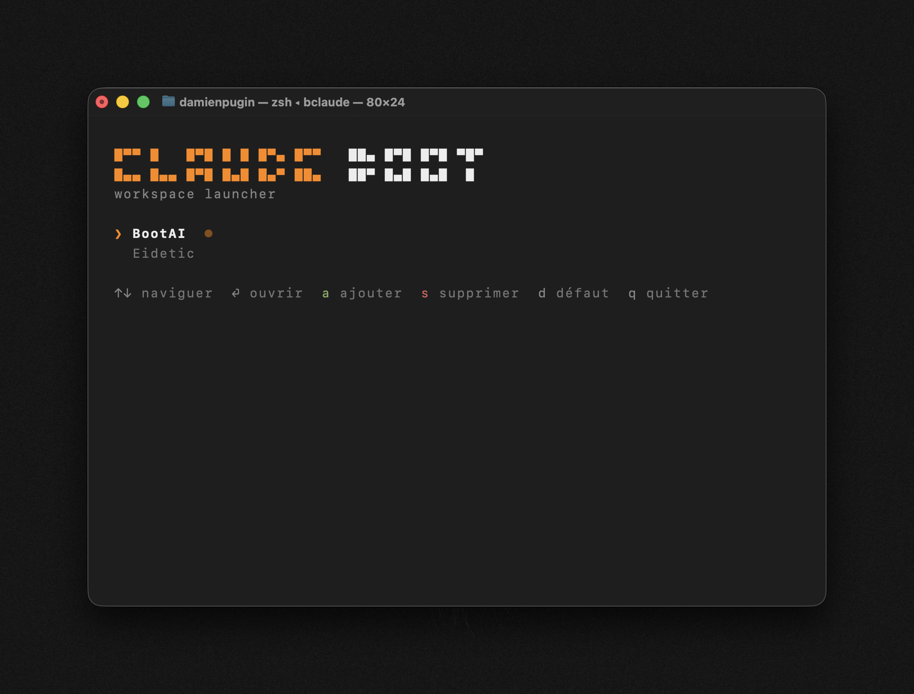

# CLAUDE BOOT

A minimal TUI workspace launcher for [Claude Code](https://docs.anthropic.com/en/docs/claude-code).

Save your most-used project folders and launch Claude Code in one keystroke — no more `cd`-ing around every time.



## Install

```sh
curl -fsSL https://raw.githubusercontent.com/damienp199/bclaude/main/install.sh | sh
```

Requires [Claude Code CLI](https://docs.anthropic.com/en/docs/claude-code) installed.

Make sure `~/.local/bin` is in your PATH. Add this to your `~/.zshrc` (or `~/.bashrc`) if needed:

```sh
export PATH="$HOME/.local/bin:$PATH"
```

## Usage

```sh
bclaude
```

| Key | Action |
|-----|--------|
| `↑` `↓` / `j` `k` | Navigate |
| `Enter` | Open workspace in Claude Code |
| `a` | Add a workspace |
| `s` | Remove a workspace |
| `d` | Set as default |
| `q` | Quit |

### Set default from CLI

```sh
bclaude --default /path/to/project
```

## How it works

- Workspaces are stored in `~/.config/bclaude/workspaces` (one path per line)
- Selecting a workspace `cd`s into it and launches `claude`
- No dependencies beyond `zsh` and `claude`

## Uninstall

```sh
rm ~/.local/bin/bclaude
rm -rf ~/.config/bclaude
```
